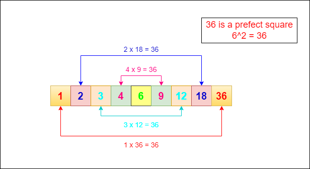

## Brute Force Approach (Solution 1)

### Intuition:

As we know the divisors of a number will definitely be lesser or equal to the number, all the numbers between 1 and the number, are the possible candidates for the divisors.

### Approach:

- This is the basic approach. As we know the possible candidates, we iterate upon all the candidates and check whether they divide the actual number.
- If it divides, then it is one of the divisors.
- Therefore, we print it.
- If it does not divide, then it is not a divisor. We do this for all the candidates.

### Time Complexity Analysis
**$O(n)$**, because the loop has to run from 1 to n always.

### Space Complexity Analysis
**$O(1)$**, we are not using any extra space.

## Optimal Approach (Solution 2)

### Intuition:

- The above method takes O(n) time complexity. We can also think of another approach. 
- If we take a closer look, we can notice that the quotient of a division by one of the divisors is actually another divisor. Like, 4 divides 36. The quotient is 9, and 9 also divides 36.
- Another intuition is that the root of a number actually acts as a splitting part of all the divisors of a number.
- Also, the quotient of a division by any divisor gives an equivalent divisor on the other side. Like, 4 gives 9 while dividing 36. See the image below.

### Approach:

- From the intuition, we can come to the conclusion that we don’t need to traverse all the candidates and if we found a single divisor, we can also find another divisor.(Here, we need to be careful, if the given number is a perfect square, like 36, 6 also give 6 as quotient. This is a corner case.)
- By keeping these in mind, it is enough if we traverse up to the root of a number. Whenever we find a divisor, we print it and also print the quotient. If the quotient is the same, we ignore it. Because the root of a perfect square will give the same quotient as itself.
- The quotients are the numbers that are on the other side of the root. So, it’s okay if we stop traversing at the root.
- This approach is more time efficient than the previous one. But the output sequences are not the same. In the previous approach, we get an ordered output unlike here.

### Time Complexity Analysis

1. The for loop iterates from 1 to the square root of 'n,' which is `int(n**(1/2))+1` times. In Big O notation, this is **$O(sqrt(n))$** because it depends on the square root of 'n.'

2. Inside the loop, the following operations are performed:
   - Checking if 'i' is a divisor of 'n' (`n % i == 0`): These operations are constant-time and can be considered **O(1)**.

   - Appending to a list: This is also a constant-time operation, and its complexity is **O(1)**.

   - Comparing 'i' with 'n/i': Another constant-time operation, also **O(1)**.

3. After the loop, the code sorts the list of divisors. Sorting a list of 'k' elements takes **$O(k * log(k))$** time in the worst case. In this case, 'k' is the number of divisors found, which can be up to **$O(sqrt(n))$**.

4. Finally, the code iterates through the sorted list and prints the divisors. Printing the divisors takes **O(k)** time, where 'k' is the number of divisors.

Therefore, the overall time complexity of the provided code for finding and printing all divisors of 'n' is **$O(sqrt(n))$** for the loop iteration and **$O(sqrt(n) * log(sqrt(n)))$** for the sorting step.

In summary, the time complexity of the provided code is **$O(sqrt(n) * log(sqrt(n)))$**.

### Space Complexity Analysis

1. **arr List**: An empty list `arr` is initialized to store the divisors. The size of this list depends on the number of divisors found. In the worst case, when 'n' is a prime number, there will be only two divisors (1 and 'n'). Therefore, the space complexity for this list is **O(2)** or simply **O(1)**.

2. **Loop Variable and Temporary Variables**: The loop variable 'i' and temporary variables used within the loop (`i != n / i`) occupy constant space, which can be considered **O(1)**.

3. **Sorting Space**: The `arr.sort()` operation sorts the list of divisors in place. Sorting typically requires additional space proportional to the size of the list being sorted. In the worst case, there can be up to **O(sqrt(n))** divisors (for a perfect square 'n'). Therefore, the space complexity for sorting is **$O(sqrt(n))$**.

4. **Printing**: The space required for printing the divisors is not dependent on the input size and can be considered constant. Therefore, the space complexity for printing is **O(1)**.

Overall, the space complexity of the provided code is determined by the space required for the `arr` list and the sorting step, which are the most significant factors. Therefore, the total space complexity is **$O(1) + O(sqrt(n)) = O(sqrt(n))$**.

In summary, the space complexity of the code is **$O(sqrt(n))$**.

