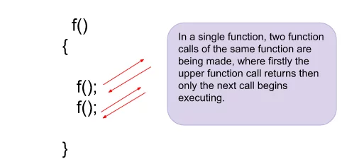
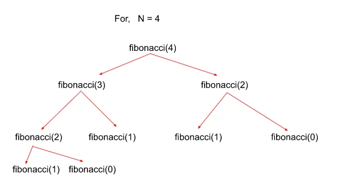

## Recursive Approach 

**Intuition:**

In this approach, instead of printing the Fibonacci series till N, we’re going to print the Nth Fibonacci number using functional recursion with multiple function calls.

One may wonder how multiple-function calls work. Let’s understand through an illustration below:

Similar kinds of multiple-function calls would be used in implementing the Fibonacci series where any Nth Fibonacci number can be written as a sum of `(N-1)`th and `(N-2)`th Fibonacci numbers. So, the function result would look like this:

`Fibonacci(N) = Fibonacci(N-1) + Fibonacci(N-2)`

Results from both the function calls would be summed and returned to the main function call.

**Approach:**

- Similar to all the recursion problems we’ve seen before, we need a base case in this problem too in order for recursion to not go infinitely. Here, we notice that the Fibonacci series start from N = 1, where we initialize its value as 1. 
- Assume `Fibonacci(0) = 0`. So, `Fibonacci(2) = 1+0 = 1` as the Nth Fibonacci number is the sum of the previous two Fibonacci numbers.
- Similarly, we call `Fibonacci(N-1)` and `Fibonacci(N-2)` and return their sum. Both the function calls `Fibonacci(N-1)` and `Fibonacci(N-2)` would be computed individually one by one until the base condition is reached for both and then they return back to the main function.

Let us see the recursion tree for the following problem to get an even better understanding:

### Time Complexity
- The time complexity of this recursive solution is $O(2^N)$ 
- This problem involves two function calls for each iteration which further expands to 4 function calls and so on (see recursive tree) which makes worst-case time complexity to be exponential in nature.

### Space Complexity
- The space complexity is $O(N)$ 
- At maximum there could be `N` function calls waiting in the recursion stack since we need to calculate the Nth Fibonacci number for which we also need to calculate `(N-1)` Fibonacci numbers before it.

*The credit for the images and the notes goes to Striver's AtoZ DSA Sheet - [TakeUForward](https://takeuforward.org/)*