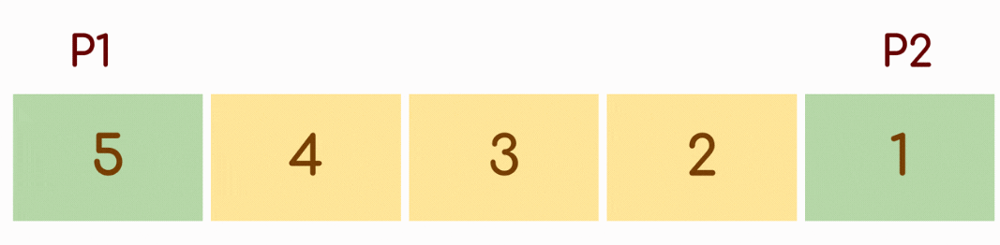

## Iterative Approach

- Keep a pointer `p1` at the first index and another `p2` at the last index of the array. 
- Swap the elements pointed by `p1` and `p2`, After swapping increment `p1` and decrement `p2`.
- This process is repeated for only the first `n/2` elements where `n` is the length of array.

**Note:** Swapping all the n elements instead of `n/2` elements leaves the array unaltered.

### Time Complexity
- The time complexity of this code is **O(n)**, where n is the length of the array `arr`. 
- This is because the code iterates through the array once in a while loop, and in each iteration, it performs constant time operations (swapping two elements and updating the pointers `p1` and `p2`).
-  Since the loop runs for `n/2` iterations (approximately), the time complexity is linear with respect to the length of the input array.

### Space Complexity
- The space complexity of this code is **O(1)**, which means it has a constant space complexity.
- Regardless of the size of the input array, the code only uses a constant amount of extra space for variables (`p1`, `p2`, and temporary storage for swapping).
- It does not use additional data structures that scale with the input size, so the space complexity remains constant.

In summary, this code efficiently reverses an array in-place with a time complexity of O(n) and a constant space complexity of O(1).

## Recursive Approach

The recursive method has an approach almost similar to the iterative one. The approach has been broken down into some steps for simplicity.

- Create a function that takes an array, start index, and end index of the array as parameters.
- Swap the elements present  at the start and end index, 
- The remaining portion of the array to be reversed is `arr[start+1,end-1]`. 
- Make a recursive call to reverse the rest of the array. While calling recursion pass `start +1`  and `ends – 1` as parameters for the shrunk array. 
- Repeat step 2.
- Continue recursion as long as the `start < end` condition is satisfied. This is the base case for our recursion.

### Time Complexity
- The time complexity of this code is **O(n)**, where `n` is the number of elements in the array
- The reason is that the `recursiveFunction` function is called recursively for each pair of elements in the array, and it swaps them. 
- Since there are `n/2` pairs of elements to be swapped, the number of recursive calls is proportional to `n/2`.
- Therefore, the time complexity is linear with respect to the number of elements in the array.

### Space Complexity
- The space complexity is **O(n)** in this case. 
- This is because for each recursive call, a new stack frame is created to store the function's local variables, including the arguments `start` and `end`. 
- Since there are `n/2` recursive calls in the worst case (when n is even), the space required for the call stack also grows linearly with the number of elements in the array.
- Therefore, the space complexity is O(n).

It's important to note that while the code uses recursion, it doesn't create a new list or consume additional memory for the reversal, so the space complexity remains O(n).

*The credit for the image goes to Striver's AtoZ DSA Sheet - [TakeUForward](https://takeuforward.org/)*