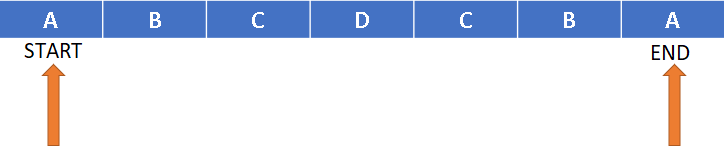
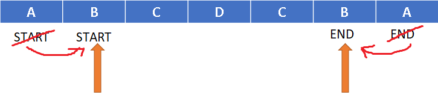

## Recursive Approach

To solve this problem, we can use a recursive approach. We'll define a helper function `isPalindromeHelper`, that takes two pointers, start and end, indicating the current positions in the string to compare.
 

- **Base Case:** If the start pointer is greater than or equal to the end pointer, we have checked all the characters in the string, and they match. So, we can return true as the string is a palindrome.
- **Recursive Case:** Check if the characters at the start and end pointers are equal:
  
    - If they are equal, we can recursively call the `isPalindromeHelper` function by moving the start pointer to the right and the end pointer to the left. This way, we compare the next pair of characters.
    
    - If unequal, we can immediately return false if the string is not a palindrome.

### Time Complexity

- The time complexity of the recursive function can be expressed as $O(N)$, where $N$ is the length of the input string. 
- In the worst case, we will perform total `(n/2)` comparisons. Therefore, the time complexity is $O(N)$.
- This is because each recursive call processes one character from the beginning and one from the end until the base case is reached.

### Space Complexity
- The space complexity is $O(1)$ as well. 
- We always return the next recursive call so they won't stack up on the call stack.
- Therefore, the space complexity is $O(1)$.

*The credit for the images and the notes goes to Striver's AtoZ DSA Sheet - [TakeUForward](https://takeuforward.org/)*